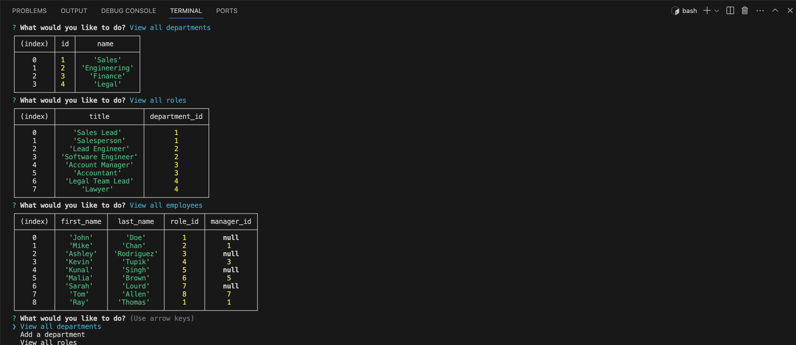

# Employee Tracker

## Description

This application displays a command line prompt that allows users to interact with an employee database. Users of the app can update or view the database based on how they answer the command line prompts.

## Table of Contents (Optional)

- [Installation](#installation)
- [Usage](#usage)
- [Credits](#credits)
- [License](#license)

## Installation

To install this project, users will need to clone the GitHub repositry onto their personal machines to be able to access the code. 

## Usage

To use the app, users will first want to open the integrated command line and run "npm install". This will install all the needed npm packages. Users will then run the command "node server.js". This will open up the command line prompts where users can select what they would like to do and follow the instructions accordingly.

    

## Credits

I was able to get valuable references from the ASU Bootcamp Student Activities as well ad the npm documentation for inquirer and mysql2.
